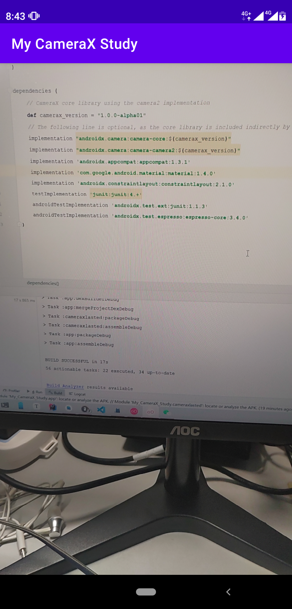

# Android 基于CameraX开发Camera预览(Java) 

开发环境:

> 基于Camera X: `1.0.0-alpha01`
>
> JDK: `JDK8`
>
> Android Studio: `4.2.2`

最终效果：



## 1. 准备工作

### 1. 1 添加依赖

在`build.gradle(app)`中添加依赖, 注意本篇部分代码只适合`1.0.0-alpha01`

```
def camerax_version = "1.0.0-alpha01"
implementation "androidx.camera:camera-core:${camerax_version}"
implementation "androidx.camera:camera-camera2:${camerax_version}"
```

### 1.2 相机权限申请

在`AndroidManifest.xml`中注册相机权限

```xml
<uses-permission android:name="android.permission.CAMERA"/>
```

相机的权限在`Android 6.0`以上还需要使用动态申请方式获取授权

使用`androidx`兼容包（即`Activity` 继承自 `androidx.XXX.AppCompatActivity`）可以参考以下代码实现动态申请：

```java
public class MainActivity extends AppCompatActivity {
	private int REQUEST_CODE_PERMISSIONS = 10; //arbitrary number, can be changed accordingly
    private final String[] REQUIRED_PERMISSIONS = new String[]{"android.permission.CAMERA"};
    
    
    
    @Override
    public void onRequestPermissionsResult(int requestCode, @NonNull String[] permissions, @NonNull int[] grantResults) {
        super.onRequestPermissionsResult(requestCode, permissions, grantResults);
        if (requestCode == REQUEST_CODE_PERMISSIONS) {
            if (allPermissionsGranted()) {
                // 获取了所有所申请的权限
            } else {
                // 有权限没有通过申请
                Toast.makeText(this, "Permissions not granted by the user.", Toast.LENGTH_SHORT).show();
                finish();
            }
        }
    }

    /**
     * 检查是否所有所请求的权限都获得许可， 固定写法
     * @return
     */
    private boolean allPermissionsGranted(){
        for(String permission : REQUIRED_PERMISSIONS){
            if(ContextCompat.checkSelfPermission(this, permission) != PackageManager.PERMISSION_GRANTED){
                return false;
            }
        }
        return true;
    }
}
```

### 1. 3 配置使用JDK8

官方文档中提到使用`Camerax`需要使用`JDK8`， 因此，在`build.gradle(app)`中配置

```
...

android {
	...
	buildTypes {
		...
	}
	compileOptions {
        sourceCompatibility JavaVersion.VERSION_1_8
        targetCompatibility JavaVersion.VERSION_1_8
    }
}
```

## 2. 开始开发

1. 布局中添加`TextureView`，参考如下：

   ```xml
   <?xml version="1.0" encoding="utf-8"?>
   <androidx.constraintlayout.widget.ConstraintLayout xmlns:android="http://schemas.android.com/apk/res/android"
       xmlns:app="http://schemas.android.com/apk/res-auto"
       xmlns:tools="http://schemas.android.com/tools"
       android:layout_width="match_parent"
       android:layout_height="match_parent"
       tools:context=".MainActivity">
       <TextureView
           android:layout_width="match_parent"
           android:layout_height="match_parent"
           android:id="@+id/ttv_camera_preview"
           app:layout_constraintTop_toTopOf="parent"
           app:layout_constraintLeft_toLeftOf="parent"
           app:layout_constraintRight_toRightOf="parent"
           app:layout_constraintBottom_toBottomOf="parent"/>
   </androidx.constraintlayout.widget.ConstraintLayout>
   ```

2. 设置Activity的成员变量：`TextureView ttv;`

3. 在`oncreate()`中，设置预览View的`OnLayoutChangeListener`（监听该View的尺寸变化）

   ```java
   ttv = findViewById(R.id.ttv_camera_preview);
   ttv.addOnLayoutChangeListener(new View.OnLayoutChangeListener() {
       @Override
       public void onLayoutChange(View v, int left, int top, int right, int bottom, int oldLeft, int oldTop, int oldRight, int oldBottom) {
           // 尺寸变化时确保预览画面的方向始终正确
           updateTransform();
       }
   });
   ```

   ```java
   /**
    * 更新相机预览, 用以保证预览方向正确, 固定写法
    */
   private void updateTransform() {
       Matrix matrix = new Matrix();
   
       // Compute the center of the view finder
       float centerX = ttv.getWidth() / 2f;
       float centerY = ttv.getHeight() / 2f;
   
       float[] rotations = {0,90,180,270};
       // Correct preview output to account for display rotation
       float rotationDegrees = rotations[ttv.getDisplay().getRotation()];
   
       matrix.postRotate(-rotationDegrees, centerX, centerY);
   
       // Finally, apply transformations to our TextureView
       ttv.setTransform(matrix);
   }
   ```

4. 在`oncreate()`中，设置在主线程启动相机预览，也是固定写法

   ```java
    /*View的宽、高确定后，将在主线程执行run()方法，此处用来启动相机*/
   ttv.post(new Runnable() {
       @Override
       public void run() {
           // 在这里启动相机
           startCamera();
       }
   });
   ```

   ```java
   private void startCamera() {}
   ```

5. 编写`startCamera`，实现预览和帧画面分析的参考写法如下，部分代码基本上是固定写法了：

   ```java
   private void startCamera() {
       // 清楚所有绑定
       CameraX.unbindAll();
   
       /**
            * 预览
            */
       // 计算屏幕参数:宽、高 、屏幕高宽比、尺寸
       int aspRatioW = ttv.getWidth(); // 预览View的宽
       int aspRatioH = ttv.getHeight(); // 预览View的高
       Rational asp = new Rational (aspRatioW, aspRatioH); // 屏幕高、宽比
       Size screen = new Size(aspRatioW, aspRatioH); // 屏幕尺寸
   
       // 通过PreviewConfig注入预览设置
       PreviewConfig pConfig = new PreviewConfig.Builder()
           .setTargetAspectRatio(asp)
           .setTargetResolution(screen)
           .build();
   
       // 根据预览配置生成预览对象，并设置预览回调（每一帧画面都调用一次该回调函数）
       Preview preview = new Preview(pConfig);
       preview.setOnPreviewOutputUpdateListener(new Preview.OnPreviewOutputUpdateListener() {
           @Override
           public void onUpdated(Preview.PreviewOutput output) {
               // 需要移除父组件后重新添加View组件，固定写法
               ViewGroup parent = (ViewGroup) ttv.getParent();
               parent.removeView(ttv);
               parent.addView(ttv, 0);
   
               ttv.setSurfaceTexture(output.getSurfaceTexture());
               updateTransform();
           }
       });
   
       /**
        * 分析
        */
       // 创建Handler用以在子线程处理数据
       HandlerThread handlerThread = new HandlerThread("Image_Analyze");
       handlerThread.start();
       // 创建ImageAnalysisConfig 配置
       ImageAnalysisConfig imageAnalysisConfig = new ImageAnalysisConfig.Builder()
           .setCallbackHandler(new Handler(handlerThread.getLooper()))
           .setImageReaderMode(ImageAnalysis.ImageReaderMode.ACQUIRE_LATEST_IMAGE)
           .setTargetAspectRatio(asp)
           .build();
   	// 根据分析配置生成分析对象，并设置分析对象（需要自定义分析类，并实现ImageAnalysis.Analyzer接口）
       ImageAnalysis imageAnalysis = new ImageAnalysis(imageAnalysisConfig);
       imageAnalysis.setAnalyzer(new MyAnalyzer());
   
   
       // 将当前Activity和preview 绑定生命周期
       CameraX.bindToLifecycle(this, preview, imageAnalysis);
   }
   /**
    * 自定义Analyzer类, 实现ImageAnalysis.Analyzer接口
    * anylyze()是每一帧画面的回调函数
    */
   private class MyAnalyzer implements ImageAnalysis.Analyzer {
       @Override
       public void analyze(ImageProxy image, int rotationDegrees) {
           // 在这里对每一帧画面进行处理
           final Image img = image.getImage();
           if (img != null) {
               Log.d("MainActivity", "Image Time Stamp is: " + img.getTimestamp());
           }
       }
   }
   ```

   

